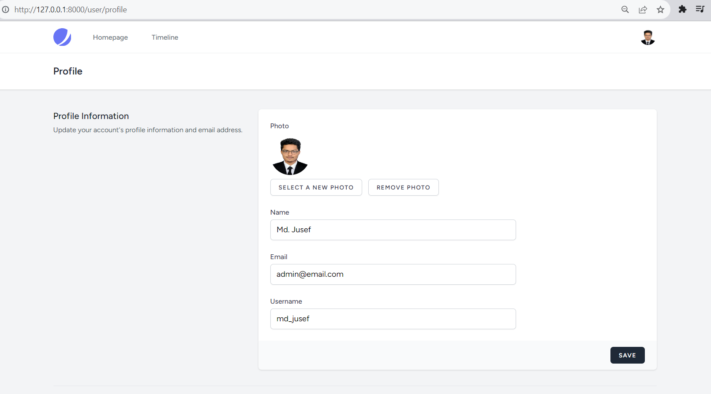
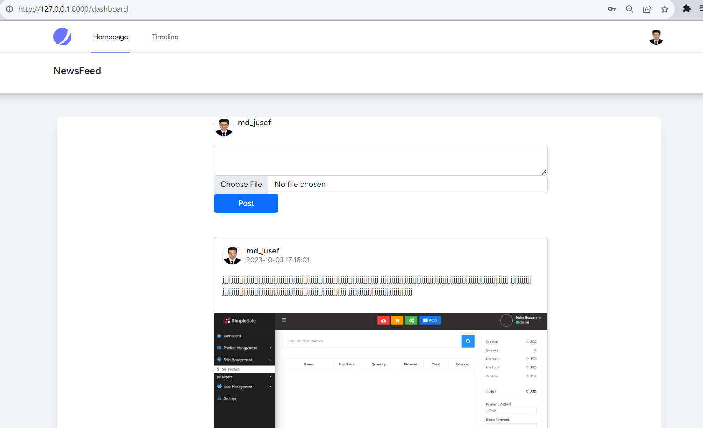
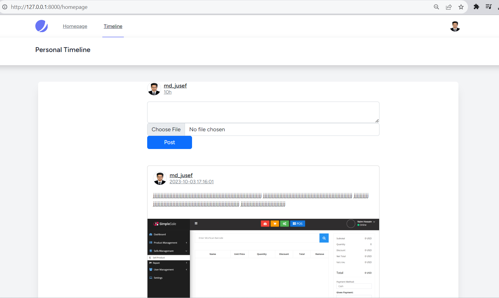
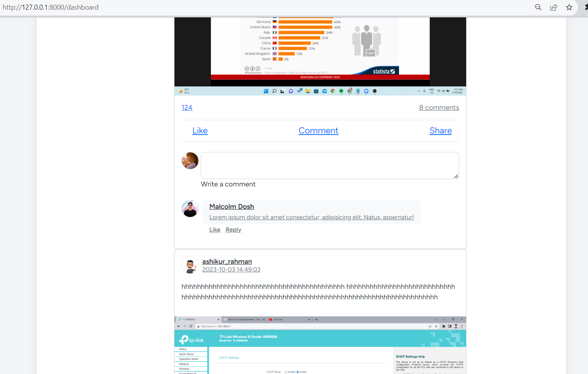

## Screenshot
<table>
    <thead>
        <tr>
            <th>
                
            </th>
            <th>
                
            </th>
        </tr>
    </thead>
</table>

<table>
    <thead>
        <tr>
            <th>
                
            </th>
            <th>
                
            </th>
        </tr>
    </thead>
</table>

<table>
    <thead>
        <tr>
            <th>
                
            </th>
            <th>
                
            </th>
        </tr>
    </thead>
</table>

## Tables and Columns
<table>
<tr>
    <th>Table Name</th>
    <th>Columns</th>
</tr>
<tr>
    <td>Users Table</td>
    <td>
        <ul>
            <li>id (Primary Key)</li>
            <li>username</li>
            <li>email</li>
            <li>password (Hashed)</li>
            <li>profile_picture</li>
        </ul>
    </td>
</tr>

<tr>
    <td>Posts Table</td>
    <td>
        <ul>
            <li>id (Primary Key)</li>
            <li>user_id (Foreign Key referencing Users)</li>
            <li>content (Text content of the post)</li>
            <li>image_path (Path to the uploaded image)</li>
            <li>created_at (Timestamp)</li>
            <li>updated_at (Timestamp)</li>
        </ul>
    </td>
</tr>

<tr>
    <td>Likes Table</td>
    <td>
        <ul>
            <li>id (Primary Key)</li>
            <li>user_id (Foreign Key referencing Users)</li>
            <li>post_id (Foreign Key referencing Posts)</li>
        </ul>
    </td>
</tr>
<tr>
    <td>Comments Table</td>
    <td>
        <ul>
            <li>id (Primary Key)</li>
            <li>user_id (Foreign Key referencing Users)</li>
            <li>post_id (Foreign Key referencing Posts)</li>
            <li>content (Text content of the comment)</li>
            <li>created_at (Timestamp)</li>
            <li>updated_at (Timestamp)</li>
        </ul>
    </td>
</tr>
<tr>
    <td>Followers Table</td>
    <td>
        <ul>
            <li>id (Primary Key)</li>
            <li>follower_id (Foreign Key referencing Users - User who follows)</li>
            <li>following_id (Foreign Key referencing Users - User being followed)</li>
        </ul>
    </td>
</tr>

</table>
<h2> Relationships:</h2>
<ul>
    <li>One User can have many Posts (One-to-Many relationship).</li>
    <li>One Post can have many Likes (One-to-Many relationship).</li>
    <li>One Post can have many Comments (One-to-Many relationship).</li>
    <li>One User can follow many Users, and a User can be followed by many Users (Many-to-Many relationship through the Followers Table).</li>
</ul>

